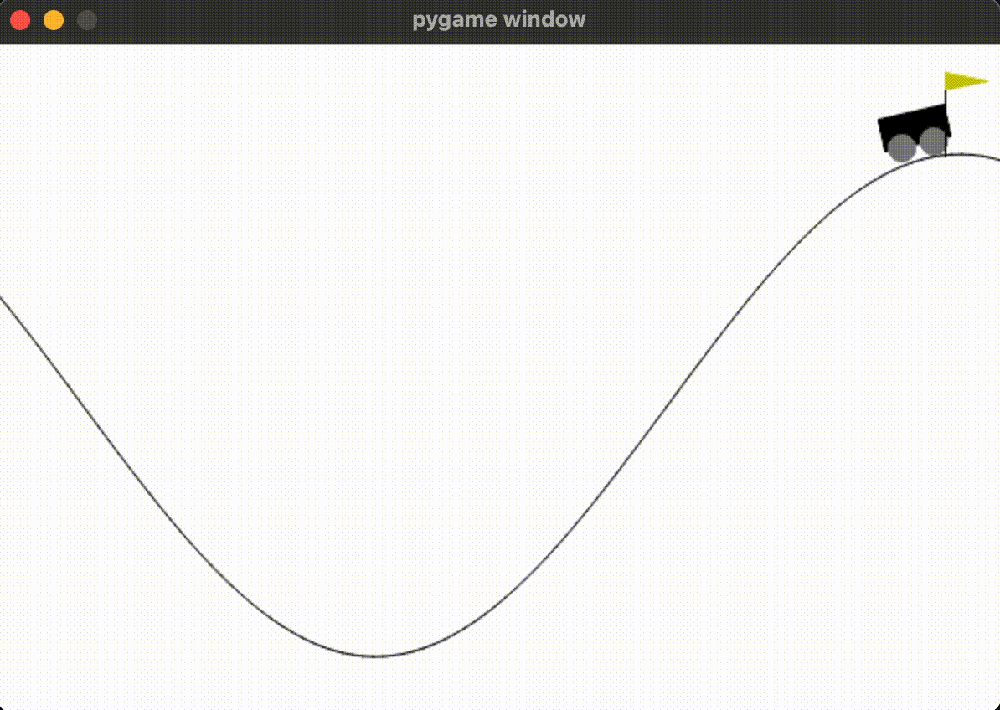
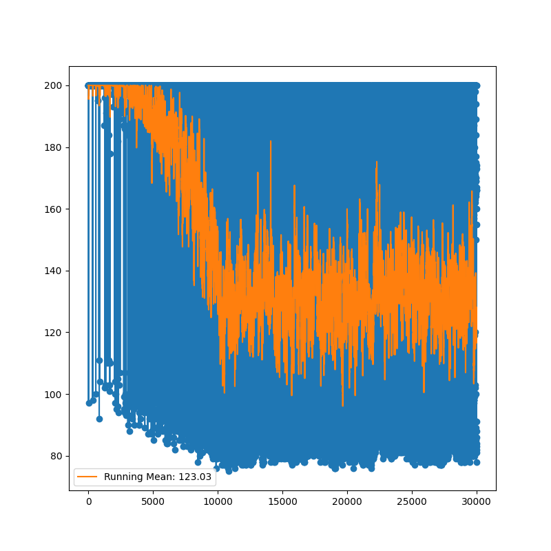

# OpenAI Mountain Car Gym Environment ⛰️

> Gym environment solving the MountainCar problem using Continuous Q-Learning.

## Results

### Simple agent results


### Continuous Q-Learning agent results



### Epoch points log tracker



## TODOs

- [x] Create simple agent
- [x] Train the agent to land exactly on the flag
- [ ] Save the model to be reused with a library like [stable-baselines](https://stable-baselines3.readthedocs.io/en/master/)

## Running

To run the gym environment first create a new Python environment and activate it. I'm using [Anaconda](https://www.anaconda.com/) for setting the python version that pipenv should use to set up the environment. The command bellow will automatically setup the environment with conda and pipenv:

```shell
make env
```

Now install all the project dependencies:

```shell
make install-all
```

To run the game to be played by a human run:

```shell
make play
```

To run the game and run random actions run:

```shell
make sample
```

To run the agent to complete the game task run:

```shell
make agent
```

To run the simple agent run:

```shell
make simple-agent 
```

> [!WARNING]
> Keep in mind that the simple agent is not using rewards to perform the actions.
> Instead is just observing the environment to use the car position and 
> velocity to use gravity to accomplish the task of climbing the hill. With
> this approach, we are not completing the secondary task of the problem
> that is landing exactly at the flag.
